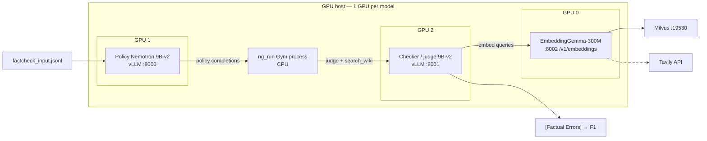

# NeMo Gym fact-checking harness

End-to-end setup for NVIDIA **NeMo Gym** fact-checking rollouts: a policy model, a checker/judge, EmbeddingGemma query embeddings, and either **Milvus** or **Tavily** behind `search_wiki`.

This repository is a snapshot of [NVIDIA-NeMo/Gym](https://github.com/NVIDIA-NeMo/Gym) (`gym/`, Apache-2.0) plus launch scripts, example configs, and a Cursor Agent Skill. Upstream Gym is unmodified except for an optional OpenAI-compatible embedding client (`milvus_embedding_base_url`) on the fact-check reward-model server.

## What you get

**One GPU per model.** The default launchers pin three processes to three separate GPUs (`CUDA_VISIBLE_DEVICES`). Do not colocate policy and checker on the same 32GB card.



| GPU (default) | Exclusive process | Port |
|---|---|---|
| 0 | EmbeddingGemma-300M only | `8002` |
| 1 | Policy `NVIDIA-Nemotron-Nano-9B-v2` only | `8000` |
| 2 | Checker / judge (same 9B weights, second replica) only | `8001` |

Extra GPUs on the box stay idle. Override with `POLICY_GPU` / `CHECKER_GPU` / `CUDA_VISIBLE_DEVICES` if your numbering differs.

`nvidia/NVIDIA-Nemotron-Nano-8B-v2` does **not** exist on Hugging Face. Use **9B-v2**.

## Hardware notes (32GB cards)

9B bf16 weights are ~16.6 GiB. That **fits** an RTX PRO 4500 32GB. Default vLLM (`--max-model-len 32768 --gpu-memory-utilization 0.90` plus CUDA graphs) does **not**: KV cache + Mamba graph warmup OOMs with ~1 GiB free.

The launchers use:

- `--max-model-len 8192`
- `--gpu-memory-utilization 0.70`
- `--max-num-seqs 8`
- `--enforce-eager` (slower decode; required to skip graph recapture)
- `VLLM_USE_FLASHINFER_SAMPLER=0`

Expect slower generations, not a failed load. Larger GPUs can drop `--enforce-eager` and raise context after a successful start.

## Prerequisites

1. Linux host with NVIDIA drivers and at least **3 GPUs** (one each for embed / policy / checker).
2. Hugging Face token with access to:
   - [`nvidia/NVIDIA-Nemotron-Nano-9B-v2`](https://huggingface.co/nvidia/NVIDIA-Nemotron-Nano-9B-v2) (accept the license)
   - [`google/embeddinggemma-300m`](https://huggingface.co/google/embeddinggemma-300m) (gated; acknowledge the license)
3. A **reachable** Milvus HTTP URI on **TCP 19530**, **or** a Tavily API key.
4. `curl`, Python 3.12+, and GPU CUDA matching the vLLM wheel you install.

Kubernetes ClusterIPs (private `10.x` / `172.x` service IPs) only work **inside** that cluster. They time out from other VPCs and from laptops. Ask for LoadBalancer `EXTERNAL-IP`, a VPN, or an SSH tunnel:

```bash
ssh -N -L 19530:<CLUSTER-IP>:19530 user@milvus-node
```

Then set `milvus_uri: "http://127.0.0.1:19530"`.

Do **not** add a private ClusterIP CIDR to an AWS route table whose only other route is `0.0.0.0/0 → igw`. That does not publish a ClusterIP and does not put Milvus on the internet.

## Quick start

```bash
git clone https://github.com/<your-user>/nemo-gym-factcheck.git
cd nemo-gym-factcheck
# First-time publish from this tree (after `gh auth login`):
#   ./scripts/publish_github.sh

export HF_TOKEN=hf_...          # or write it to .hf_token (mode 600)
chmod +x scripts/*.sh

./scripts/setup_venvs.sh
cp deploy/env.yaml.example gym/env.yaml
cp deploy/milvus_override.yaml.example gym/milvus_override.yaml
# edit gym/milvus_override.yaml → milvus_uri you can actually curl

./scripts/start_embed_gemma.sh
./scripts/start_vllm_policy_checker.sh
# wait until logs say "Application startup complete" (about 1 minute)
./scripts/check_endpoints.sh

# prove Milvus (must not time out)
curl -m 5 -v http://127.0.0.1:19530    # or your EXTERNAL-IP:19530

./scripts/start_gym.sh                 # leave this terminal running
```

Second terminal:

```bash
cd nemo-gym-factcheck
source gym/.venv/bin/activate
./scripts/collect_rollouts.sh
# or your dataset:
# INPUT_JSONL=/path/to/factcheck_input.jsonl OUTPUT_JSONL=./factcheck_output.jsonl ./scripts/collect_rollouts.sh
```

Your dataset should already be Gym-shaped (`id` + `responses_create_params` with a `search_wiki` tool). To convert an audited JSONL:

```bash
python3 scripts/convert_audited_jsonl.py /path/to/audited.jsonl \
  --out factcheck_input.jsonl --labels factcheck_labels.jsonl
```

## Tavily instead of Milvus

This host can reach the public internet even when it cannot reach a ClusterIP.

```bash
export TAVILY_API_KEY=tvly-...
uv pip install --python gym/.venv/bin/python tavily-python
BACKEND=tavily ./scripts/start_gym.sh
```

Second terminal:

```bash
BACKEND=tavily ./scripts/collect_rollouts.sh
```

Scores will **not** match FineWeb/Milvus retrieval. Same `search_wiki` tool, different evidence.

## Scripts

| Script | Purpose |
|---|---|
| `scripts/setup_venvs.sh` | Gym + embed + vLLM virtualenvs |
| `scripts/start_embed_gemma.sh` | GPU0 EmbeddingGemma `:8002` |
| `scripts/start_vllm_policy_checker.sh` | GPU1/2 Nemotron `:8000` / `:8001` |
| `scripts/check_endpoints.sh` | `curl` the three local HTTP APIs |
| `scripts/start_gym.sh` | `ng_run` (set `BACKEND=tavily` to skip Milvus) |
| `scripts/collect_rollouts.sh` | `ng_collect_rollouts` |
| `scripts/stop_servers.sh` | Stop embed + vLLM pidfiles |
| `scripts/convert_audited_jsonl.py` | Audited JSONL → Gym input + label sidecar |
| `scripts/publish_github.sh` | `gh repo create --public` + push (requires `gh auth login`) |

Environment overrides: `POLICY_GPU`, `CHECKER_GPU`, `MAX_MODEL_LEN`, `GPU_MEM_UTIL`, `EMBED_PORT`, `HF_TOKEN`, `MILVUS_URI`.

## Cursor Agent Skill

Project skill (this repo):

```
.cursor/skills/nemo-gym-fact-check/SKILL.md
```

Copy into `~/.cursor/skills/nemo-gym-fact-check/` to use it in other workspaces. In Cursor, ask the agent to follow the **nemo-gym-fact-check** skill when setting up or running this pipeline.

## Verify

```bash
curl -s http://127.0.0.1:8000/v1/models   # policy, 9B-v2, max_model_len 8192
curl -s http://127.0.0.1:8001/v1/models   # checker
curl -s http://127.0.0.1:8002/healthz     # embed
curl -m 5 -v "$MILVUS_URI"                # must not hang
```

Empty `curl /v1/models` while GPU memory is high usually means EngineCore is still loading **or already crashed**. Read `vllm_policy.log` for OOM / ninja / `CUDA_HOME` before retrying.

## License

- `gym/` — NVIDIA NeMo Gym, Apache-2.0 (`gym/LICENSE`)
- Scripts and skill in this overlay — Apache-2.0
