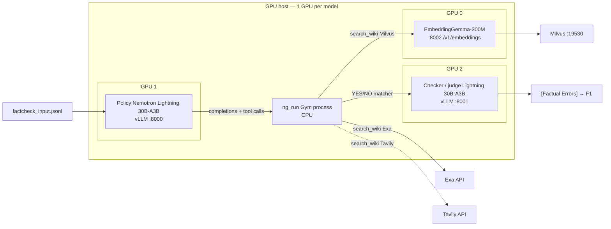

# NeMo Gym fact-checking harness

End-to-end setup for NVIDIA **NeMo Gym** fact-checking rollouts: a policy model, a checker/judge, and `search_wiki` backed by EmbeddingGemma + **Milvus**, **Exa**, or **Tavily**.

This repository is a snapshot of [NVIDIA-NeMo/Gym](https://github.com/NVIDIA-NeMo/Gym) (`gym/`, Apache-2.0) plus launch scripts, example configs, and a Cursor Agent Skill. Gym is patched for this harness: optional OpenAI-compatible embeddings (`milvus_embedding_base_url`), policy search cap, line-count `num_errors`, per-sample step timings, and YES/NO-only judging.

## What you get

**One GPU per model.** The default launchers pin three processes to three separate GPUs (`CUDA_VISIBLE_DEVICES`). Do not colocate policy and checker on the same 32GB card.


```mermaid
flowchart LR
  subgraph host["GPU host — 1 GPU per model"]
    direction TB
    subgraph g0["GPU 0"]
      E["EmbeddingGemma-300M<br/>:8002 /v1/embeddings"]
    end
    subgraph g1["GPU 1"]
      P["Policy Nemotron Lightning 30B-A3B<br/>vLLM :8000"]
    end
    subgraph g2["GPU 2"]
      C["Checker / judge Lightning 30B-A3B<br/>vLLM :8001"]
    end
    Gym["ng_run Gym process<br/>CPU"]
  end
  In["factcheck_input.jsonl"] --> P
  P -->|"completions + tool calls"| Gym
  Gym -->|"search_wiki Milvus"| E
  E --> M["Milvus :19530"]
  Gym -->|"search_wiki Exa"| X["Exa API"]
  Gym -.->|"search_wiki Tavily"| T["Tavily API"]
  Gym -->|"YES/NO matcher"| C
  C --> Out["[Factual Errors] → F1"]
```

| GPU (default) | Exclusive process | Port |
|---|---|---|
| 0 | EmbeddingGemma-300M only | `8002` |
| 1 | Policy `NVIDIA-Nemotron-3.5-Lightning-30B-A3B-BF16` only | `8000` |
| 2 | Checker / judge (same Lightning weights, second replica) only | `8001` |

Extra GPUs on the box stay idle. Override with `POLICY_GPU` / `CHECKER_GPU` / `CUDA_VISIBLE_DEVICES` if your numbering differs.

`nvidia/NVIDIA-Nemotron-Nano-8B-v2` does **not** exist on Hugging Face. Lightning is the default. 9B-v2: `POLICY_MODEL=nvidia/NVIDIA-Nemotron-Nano-9B-v2`.

## Scoring and retrieval

`search_wiki` hits **Milvus FineWeb**, **Exa**, or **Tavily**. The policy may issue at most **3 unique** queries (`max_search_calls`); duplicate queries are stubbed. First step is forced `tool_choice: required`; after the search budget, `tool_choice: none` writes the tagged verdict.

HyDE is on for the Milvus and Exa agents (`hyde_search_queries: true`). The agent tells the policy to send one short hypothetical passage: clues already written in the claim only, unknowns as `[YEAR]`, `[NAME]`, `[METHOD]`, or `[CHANNEL]`. Do not guess the answer. The posted query is still the model's string. The 156-row Milvus and Exa comparison was collected with this flag off. To repeat that comparison, set `hyde_search_queries: false` and bounce Gym only.

F1 is vs gold `expected_errors`, not vs the corpus:

- Empty gold `[]`: F1 1 when the error box is blank, or one line such as `none`, `none found`, `n/a`, or `no factual errors`. A box whose only line is `(empty)`, `[None]`, `(No factual errors)`, or `[]` counts as one error.
- Filled gold: YES/NO matcher on `:8001` vs the **whole** error box; `num_errors` is **line-count** (the count LLM is not called).

Collect **appends**. Always use a new `OUTPUT_JSONL`. A compact sidecar `*.metrics.jsonl` stores per-sample F1 and `t_*` step times (`t_count_judge_s` should be 0). Gym Python changes: `./scripts/stop_gym.sh` then `./scripts/start_gym.sh` — leave vLLM/embed running.

Do not tune on a single crossword row. Use a mixed empty/filled slice (`scripts/extract_mixed_gold_slice.py`) and `scripts/summarize_slice_timings.py`.

## Hardware notes

**Lightning 30B-A3B (default):** `--max-model-len 131072`, `--gpu-memory-utilization 0.85`, prefix caching, Triton mamba unless `nvcc` is present (`MAMBA_BACKEND=flashinfer`), `--tool-call-parser qwen3_coder`, `--reasoning-parser nemotron_v3`. One replica fits a 96GB card (H100 80GB is tight at 131072; RTX PRO 6000 96GB has headroom). Weights alone are about 60GB, so a 48GB card does not fit.

**9B-v2 on 32GB:** weights fit; default vLLM 32k + 0.90 util OOMs. Use `POLICY_MODEL=nvidia/NVIDIA-Nemotron-Nano-9B-v2 MAX_MODEL_LEN=8192` (0.70 util, `--enforce-eager`, `nemotron_json` parser plugin).

## Prerequisites

1. Linux host with NVIDIA drivers and at least **3 GPUs** (one each for embed / policy / checker).
2. Hugging Face token with access to:
   - [`nvidia/NVIDIA-Nemotron-3.5-Lightning-30B-A3B-BF16`](https://huggingface.co/nvidia/NVIDIA-Nemotron-3.5-Lightning-30B-A3B-BF16) (OpenMDW; accept if gated)
   - [`google/embeddinggemma-300m`](https://huggingface.co/google/embeddinggemma-300m) (gated; acknowledge the license)
3. A **reachable** Milvus HTTP URI on **TCP 19530**, an Exa API key, or a Tavily API key. Exa does not use Milvus or the embed server.
4. `curl`, Python 3.12+, and GPU CUDA matching the vLLM wheel you install.

Kubernetes ClusterIPs (private `10.x` / `172.x` service IPs) only work **inside** that cluster. They time out from other VPCs and from laptops. Ask for LoadBalancer `EXTERNAL-IP`, a VPN, or an SSH tunnel:

```bash
ssh -N -L 19530:<CLUSTER-IP>:19530 user@milvus-node
```

Then set `milvus_uri: "http://127.0.0.1:19530"`.

Do **not** add a private ClusterIP CIDR to an AWS route table whose only other route is `0.0.0.0/0 → igw`. That does not publish a ClusterIP and does not put Milvus on the internet.

## Quick start

```bash
git clone https://github.com/<your-user>/nemo-gym-factcheck.git
cd nemo-gym-factcheck
# First-time publish from this tree (after `gh auth login`):
#   ./scripts/publish_github.sh

export HF_TOKEN=hf_...          # or write it to .hf_token (mode 600)
chmod +x scripts/*.sh

./scripts/setup_venvs.sh
cp deploy/env.yaml.example gym/env.yaml
cp deploy/milvus_override.yaml.example gym/milvus_override.yaml
# edit gym/milvus_override.yaml → milvus_uri you can actually curl

./scripts/start_embed_gemma.sh
./scripts/start_vllm_policy_checker.sh
# Lightning 30B takes several minutes. Wait until BOTH logs print
# "Application startup complete". An earlier curl fails because nothing is listening.
# tail -f vllm_policy.log vllm_checker.log
./scripts/check_endpoints.sh

# Prove the milvus_uri in gym/milvus_override.yaml. Use 127.0.0.1:19530 only
# after the tunnel in Prerequisites. A remote host that times out will crash Gym.
curl -m 5 -v http://<milvus-host>:19530

./scripts/start_gym.sh                 # leave this terminal running
```

Second terminal. Milvus with no `INPUT_JSONL` reads `examples/factcheck_example.jsonl`, not the 156-row set:

```bash
cd nemo-gym-factcheck
source gym/.venv/bin/activate
INPUT_JSONL=data/rlhf24_final_audited_dataset.jsonl \
  OUTPUT_JSONL=./factcheck_output.jsonl \
  NUM_SAMPLES_IN_PARALLEL=2 \
  ./scripts/collect_rollouts.sh
# mixed 4 empty + 6 filled (skips Chris Rock):
# python3 scripts/extract_mixed_gold_slice.py data/rlhf24_final_audited_dataset.jsonl data/rlhf24_mixed10.jsonl
# INPUT_JSONL=data/rlhf24_mixed10.jsonl OUTPUT_JSONL=./factcheck_output_mixed10.jsonl NUM_SAMPLES_IN_PARALLEL=2 ./scripts/collect_rollouts.sh
# python3 scripts/summarize_slice_timings.py ./factcheck_output_mixed10.jsonl
```

## Dataset

`data/rlhf24_final_audited_dataset.jsonl` is the audited RLHF fact-check set used in this harness: **156 JSON objects** (the full file; often referred to as the L1–L157 slice). Each row already has Gym `responses_create_params` (including `search_wiki`) plus gold `hallucination_severity` / `expected_errors`.

To strip labels into a sidecar (Gym only needs `id` + `responses_create_params`):

```bash
python3 scripts/convert_audited_jsonl.py data/rlhf24_final_audited_dataset.jsonl \
  --out factcheck_input.jsonl --labels factcheck_labels.jsonl
```

## Tavily instead of Milvus

This host can reach the public internet even when it cannot reach a ClusterIP.

```bash
export TAVILY_API_KEY=tvly-...
uv pip install --python gym/.venv/bin/python tavily-python
BACKEND=tavily ./scripts/start_gym.sh
```

Second terminal:

```bash
BACKEND=tavily ./scripts/collect_rollouts.sh
```

Scores will **not** match FineWeb/Milvus retrieval. Same `search_wiki` tool, different evidence.

## Exa instead of embeddings + Milvus

Same policy, checker, and F1 scorer as the Milvus run. `search_wiki` POSTs the query to `https://api.exa.ai/search` and returns page text. No EmbeddingGemma and no Milvus. Gold is the same audited set, `data/rlhf24_final_audited_dataset.jsonl` (`expected_errors` / `hallucination_severity` on each row).

Agent name: `fact_checking_reward_model_exa_simple_agent`. Defaults: Exa `type=auto`, `numResults` = `search_top_k` (3), up to 8000 characters of page text per hit. HyDE is on here too, same flag as the Milvus agent.

Stop the Milvus Gym process first (`./scripts/stop_gym.sh`). Leave policy `:8000` and checker `:8001` running. Embed `:8002` is unused.

```bash
export EXA_API_KEY=...
BACKEND=exa ./scripts/start_gym.sh
```

Second terminal:

```bash
BACKEND=exa NUM_SAMPLES_IN_PARALLEL=2 ./scripts/collect_rollouts.sh
# writes ./factcheck_output_exa.jsonl (appends; use a new OUTPUT_JSONL to keep runs apart)
```

## Scripts

| Script | Purpose |
|---|---|
| `scripts/setup_venvs.sh` | Gym + embed + vLLM virtualenvs |
| `scripts/start_embed_gemma.sh` | GPU0 EmbeddingGemma `:8002` |
| `scripts/start_vllm_policy_checker.sh` | GPU1/2 Nemotron `:8000` / `:8001` |
| `scripts/check_endpoints.sh` | `curl` the three local HTTP APIs |
| `scripts/start_gym.sh` | `ng_run` (`BACKEND=milvus`, `BACKEND=exa`, or `BACKEND=tavily`) |
| `scripts/stop_gym.sh` | Stop Gym only (leave vLLM/embed) |
| `scripts/stop_vllm.sh` / `scripts/stop_servers.sh` | Stop vLLM / embed+vLLM |
| `scripts/collect_rollouts.sh` | `ng_collect_rollouts` (`NUM_SAMPLES_IN_PARALLEL`, `INPUT_JSONL`, `OUTPUT_JSONL`) |
| `scripts/extract_mixed_gold_slice.py` | 4 empty + 6 filled gold, skip Chris Rock |
| `scripts/summarize_slice_timings.py` | Empty vs filled F1 + `t_*` from `.metrics.jsonl` |
| `scripts/collect_timing.py` | p95 latency + samples/min |
| `scripts/show_scored_errors.py` | Gold vs predicted error box + step table |
| `scripts/convert_audited_jsonl.py` | Audited JSONL → Gym input + label sidecar |
| `scripts/publish_github.sh` | `gh repo create --public` + push (requires `gh auth login`) |

Environment overrides: `POLICY_GPU`, `CHECKER_GPU`, `MAX_MODEL_LEN`, `GPU_MEM_UTIL`, `EMBED_PORT`, `HF_TOKEN`, `MILVUS_URI`.

## Cursor Agent Skill

Project skill (this repo):

```
.cursor/skills/nemo-gym-fact-check/SKILL.md
```

Copy into `~/.cursor/skills/nemo-gym-fact-check/` to use it in other workspaces. In Cursor, ask the agent to follow the **nemo-gym-fact-check** skill when setting up or running this pipeline.

## Verify

```bash
curl -s http://127.0.0.1:8000/v1/models   # policy Lightning (or 9B-v2)
curl -s http://127.0.0.1:8001/v1/models   # checker / YES/NO matcher
curl -s http://127.0.0.1:8002/healthz     # embed
curl -m 5 -v "$MILVUS_URI"                # must not hang
```

Empty `curl /v1/models` while GPU memory is high usually means EngineCore is still loading **or already crashed**. Read `vllm_policy.log` for OOM / ninja / `CUDA_HOME` before retrying.

## License

- `gym/` — NVIDIA NeMo Gym, Apache-2.0 (`gym/LICENSE`)
- Scripts and skill in this overlay — Apache-2.0

Do not commit `.hf_token`, `gym/env.yaml`, `gym/milvus_override.yaml`, or `factcheck_output*.jsonl`.
